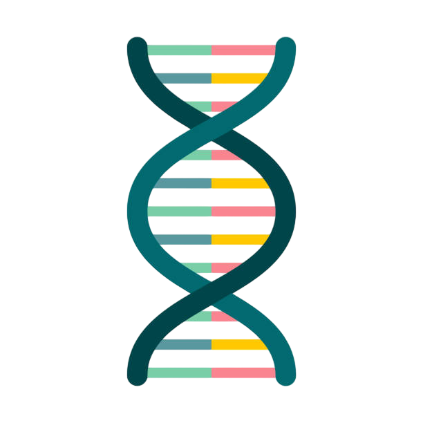

<a name="readme-top"></a>

<p align="center">
  <a href="https://github.com/adkoprek/Needleman-Wunsch/graphs/contributors">
	  
  </a>
  <a href="https://github.com/adkoprek/Needleman-Wunsch/network/members">
	  
  </a>
  <a href="https://github.com/adkoprek/Needleman-Wunsch/stargazers">
	  
  </a>
  <a href="https://github.com/adkoprek/Needleman-Wunsch/issues">
	  
  </a>
  <a href="https://github.com/adkoprek/Needleman-Wunsch/blob/master/LICENSE.txt">
	  
  </a>
</p>
<br />

<br />
<div align="center">
  <a href="https://github.com/adkoprek/Needleman-Wunsch">
    
  </a>

  <h3 align="center">Needleman Wunsch Algorithem</h3>

  <p align="center">
    An awesome implementation of the Needleman Wunsch
    <br />
    <a href="https://github.com/adkoprek/Needleman-Wunsch/issues/new?labels=bug&template=bug-report---.md">Report Bug</a>
    ·
    <a href="https://github.com/adkoprek/Needleman-Wunsch/issues/new?labels=enhancement&template=feature-request---.md">Request Feature</a>
  </p>
</div>

## About The Project

<p align="center">
  
</p>

This is a clena implementation of the Needleman Wunsch Algorithem in C# with an very strict OOP approach. The project also implements a command line interface

### Built With
[![C#][cs.js]][cs-url]

## Getting Started

If you want your own copy just follow this steps

```bash
git clone https://github.com/adkoprek/Needleman-Wunsch
```

### Prerequisites

Minimum required sdk and runtime is `.net6.0`

## Usage

Compile the project
```bash
dotnet build
```

Run the Project on Linux
```bash
./NeedlemanWunsch/bin/Debug/net6.0/NeedlemanWunsch -x <First Sequence> -y <Second Sequence>
```

Run the Project on Windows
```bash
./NeedlemanWunsch/bin/Debug/net6.0/NeedlemanWunsch.exe -x <First Sequence> -y <Second Sequence>
```

## Contributing

Contributions are what make the open source community such an amazing place to learn, inspire, and create. Any contributions you make are **greatly appreciated**.

If you have a suggestion that would make this better, please fork the repo and create a pull request. You can also simply open an issue with the tag "enhancement".
Don't forget to give the project a star! Thanks again!

1. Fork the Project
2. Create your Feature Branch (`git checkout -b feature/AmazingFeature`)
3. Commit your Changes (`git commit -m 'Add some AmazingFeature'`)
4. Push to the Branch (`git push origin feature/AmazingFeature`)
5. Open a Pull Request

## License

Distributed under the MIT License. See `LICENSE.txt` for more information.

## Contact

Adam Korpek - adam.koprek@edu.schulen-Turgi.ch

[cs.js]: https://img.shields.io/badge/C%23-239120?style=for-the-badge&logo=csharp&logoColor=white
[cs-url]: https://dotnet.microsoft.com/languages/csharp
